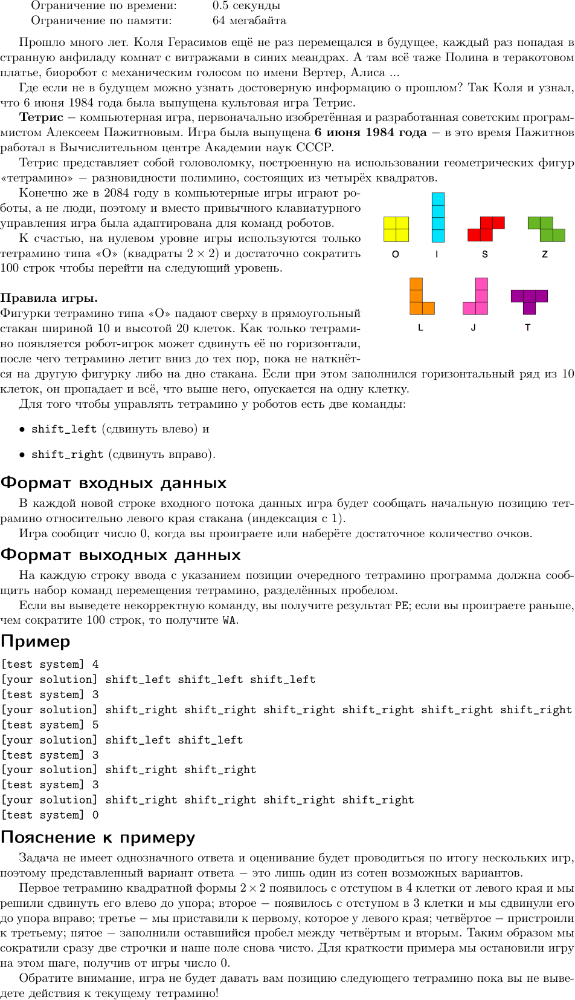
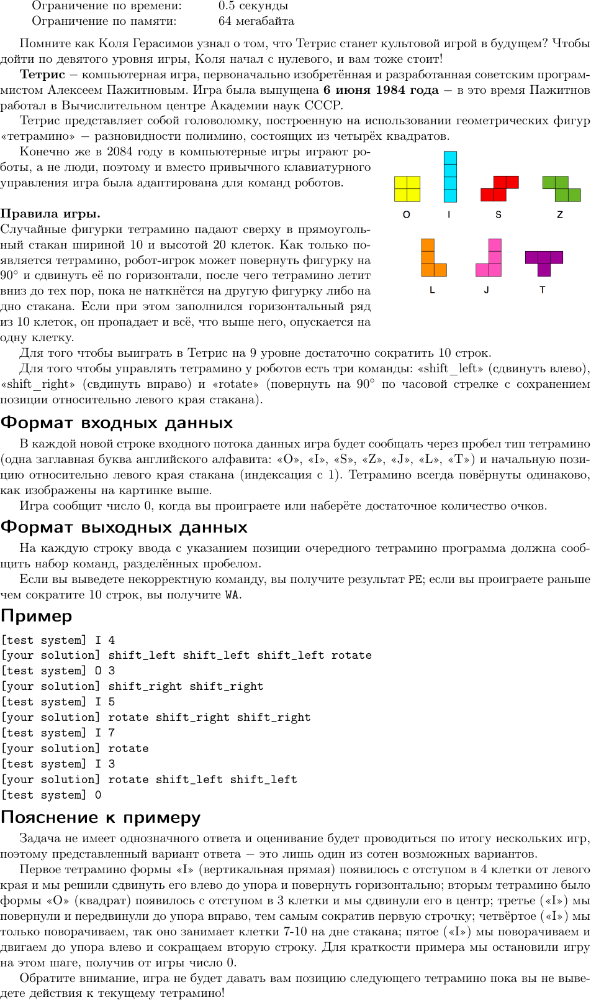

# Задача Тетрис (KhCup XVII 2020)

Данная задача имеет две модификации: Уровень 0 и Уровень 9


## Тетрис - Уровень 0




## Тетрис - Уровень 9




## Как запустить?

### Запуск вручную

1. Создать файл `answer.txt` в папке `tetris-interactor`, куда записать одно
   число - число сокращаемых строк, к которым стремимся, например, по условию
   задачи, 10.
2. Скомпилировать и запустить tetris-interactor (нужен компилятор Rust):

    ```bash
    $ cd tetris-interactor
    $ cargo run --release
    ```
3. Скомпилировать и запустить решение (в отдельном окне)
4. Вручную переписывать вывод из tetris-interactor в решение и обратно


### Запуск автоматически (только на Linux) с использованием DDOTS-runner

1. Скомпилировать tetris-interactor (нужен компилятор Rust):

    ```bash
    $ cd tetris-interactor
    $ cargo build --release
    ```
2. Скопировать исполняемый файл из `target/release/tetris-interactor` в папку `problem-level-0/`
3. Скачать и распаковать [ddots-runner](https://gitlab.com/dots.org.ua/ddots-runner/-/jobs/343795772/artifacts/download)
4. Скомпилировать решение
5. Запустить:

    ```bash
    $ sudo env RUST_LOG=trace ./ddots-runner \
        --problem-root ./problem-level-0 \
        --solution-filepath ./solution \
        --semitrusted-service-sandbox-user "$(whoami)"
    ```

    , где `./solution` - это путь к исполняемому файлу решения


## Как визуализировать партию?

1. Модифицируйте своё решение так, чтобы оно вело лог партии в файл в следующем формате:

    ```
    O 4
    shift_left
    I 1
    shift_right rotate shift_right
    ```
2. Вставьте полученный лог в форму на https://khcup.dots.org.ua/tetris (или запустите tetris-viewer локально)

Примеры логов игры:
* Логи игры за Level 0 (решение `solutions-level-0/frol.py`): https://khcup.dots.org.ua/static/tetris-level-0.log
* Логи игры за Level 9 (решение `solutions-level-9/frol/src/main.rs`): https://khcup.dots.org.ua/static/tetris-level-9-frol.log (сокращает 54 строчки)

Лог фигурок на Level 9 для сравнения на том же раунде: https://khcup.dots.org.ua/static/tetris-level-9.txt
